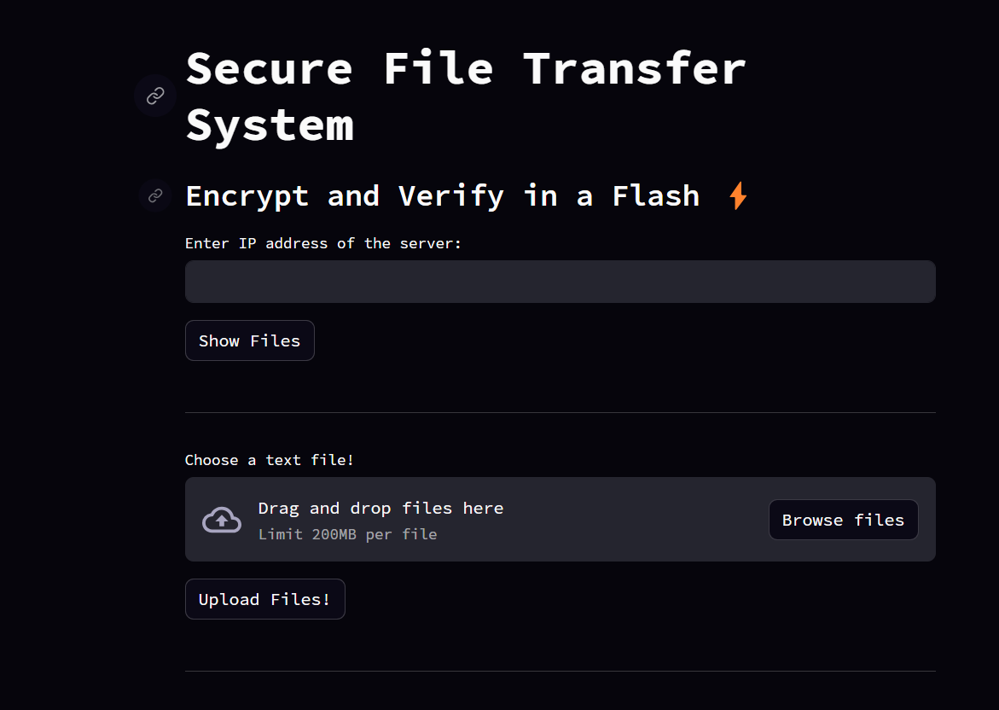
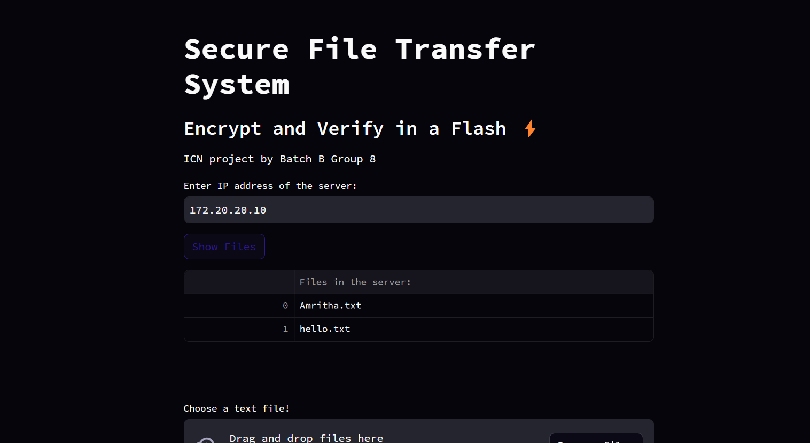
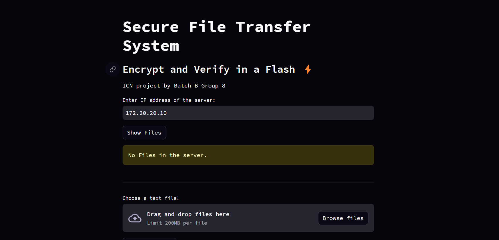
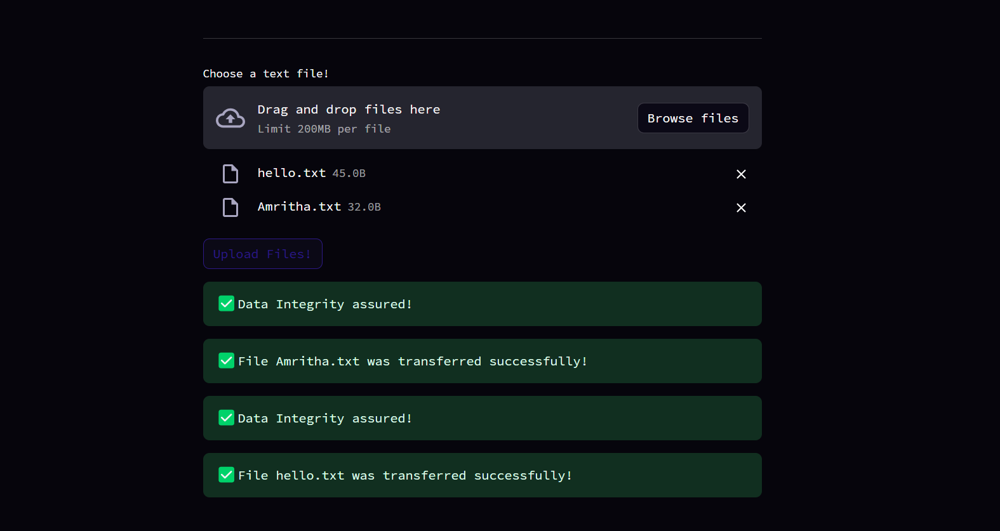
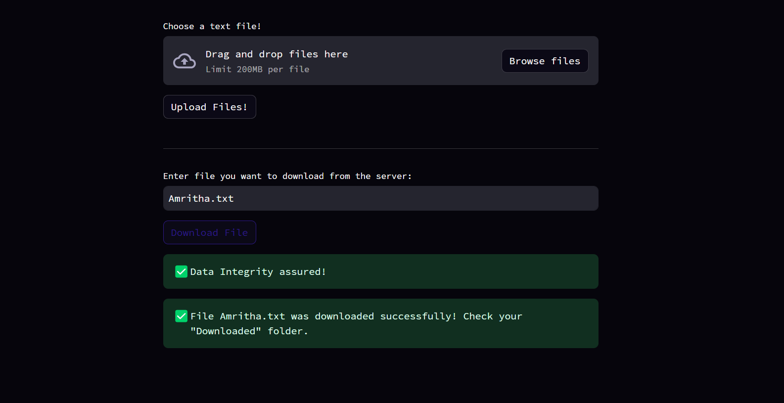
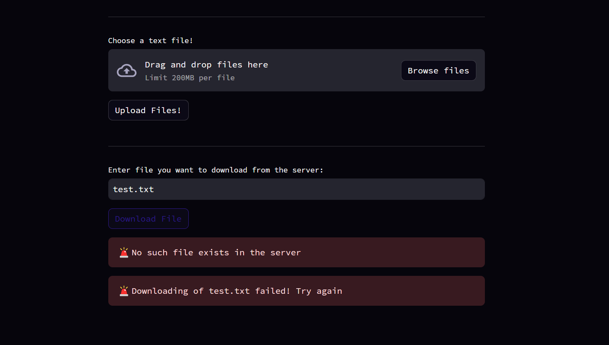

# Secure File Transfer System with Merkle Tree

This repository contains a secure file transfer system implemented in Python, providing a reliable and encrypted method for uploading, downloading, and displaying files between a client and server. The system incorporates Fernet symmetric encryption for secure data transmission and uses Merkle trees for integrity verification.



## Features

- **Secure Communication:**
  - Utilizes sockets for reliable communication between the client and server.
  - Implements Fernet symmetric encryption to secure file data during transmission.

- **Merkle Tree Integrity Verification:**
  - Breaks files into chunks and constructs a Merkle tree to verify data integrity.
  - Ensures files are transferred without corruption or loss.

- **User-Friendly Interface with Streamlit:**
  - A Streamlit web application provides an intuitive interface for users.
  - Supports file upload, download, and file listing functionalities.

- **Logging and Error Handling:**
  - Implements logging for better traceability and debugging.
  - Error handling to manage unexpected scenarios.

## Repository Structure

- **client.py:** Client-side implementation, including functions for file upload, download, and displaying available files.
  
- **server.py:** Server-side implementation, managing client connections, handling file transfers, and implementing Merkle tree verification.

- **logs.csv:** Log file storing important events, timestamps, and the status of file transfers.

- **requirements.txt:** Lists necessary dependencies for running the system.

## How to Use

1. Clone the repository to your local machine.
   ```bash
   git clone https://github.com/amri-tah/Secure-File-Transfer.git
   ```

2. Install the required dependencies.
   ```bash
   pip install -r requirements.txt
   ```

3. Run the server script on the server.
   ```bash
   python server.py
   ```

4. Open the Streamlit web application on the client side.
   ```bash
   python client.py
   ```

Interact with the system through the web interface to securely upload, download, and display files.

## Screenshots

#### Show Files in Server:



#### Upload Files to Server:


#### Download Files from Server:


